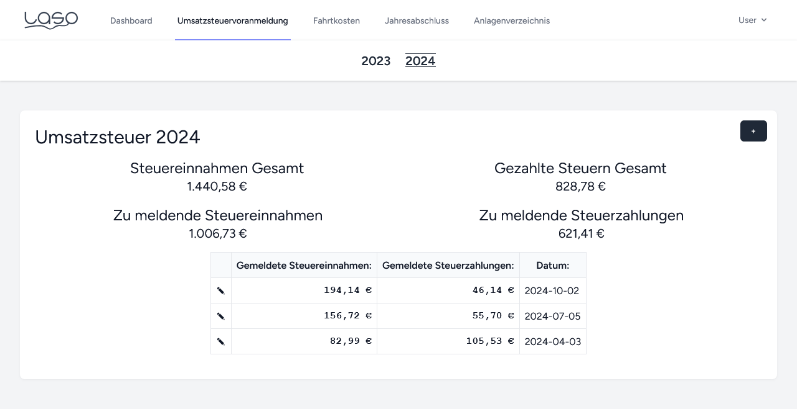

## Disclaimer: Is it perfect? By far no! Is it doing it's job? For me: Absolutely!

This was coded part time in a week while working a full time job. There is still tons of room for improvements. If you have ideas on how to improve LASO, feel free to let me know. Right now LASO concentrates heavily on helping to create the **German "Einnahmen-Überschuss-Rechnung"** (EÜR) and most likely is of no use in any other country. But eventually we're getting there if anyone is interested in extending LASO.

# LASO

Laravel annual statement online (a small online tool to do the annual statement in Germany for one person companies)

LASO consists of multiple modules:

### Dashboard

The dasboard is where you start after the login. It gives you an overview over all revenues and expenses for the current year. Here you also have to possibility to add new revenues and expenses. Use the edit icon to edit or delete them.

### Revenue

This allows you to input all Revenues you had.

### Expenses

For all Expenses, you can select an expense type, which will then be taken into account for the annual statement. Each expense has an cost type. Some cost types have a ratio, e. g. Internet can only be added 50 %, as it is also used personally. There is one special cost type (Afa), that is used for the depreciations. If this one is selected, you have to define the depreciation time in years. Those Expenses will then automatically be added to the Inventory and taken into account for the annual statement, until the Expenses are completely written off.

### VAT Notice

You can use LASO to track your VAT notices (Umsatzsteuervoranmeldung). As you can define the date yourself, you can either add one notice per month or per quarter.

### Travel allowance (Kilometergeld)

Here you can add all journeys. Right now, for the first 20km 0.30€ are calculated and 0.36€ from km 21.

### Annual statement (most important)

This shows the annual statement, that is needed in Germany for the tax report. It's created automatically based on all the data in LASO. For retention, the statement has a nice print view, which allows to create a immutable pdf.

### Inventory

Here you can find an overview over all Expenses from cost type Afa (depreciations). The table shows the date of purchase, the depreciation time and the amount in the first and last year and in between.

### Yep, there is a dark-mode as well

### Deployment (manually)

1. Move relevant files to prod environment (or use git clone)
    - app, bootstrap, config, database, lang, public, resources, routes, storage
    - .env.example, artisan, composer.json, composer.lock
1. Copy `.env.example` to `.env` and fill in application configuration
1. Run `composer install --optimize-autoloader --no-dev`
1. Run `php artisan migrate --seed` <- seeder is needed to fill cost types table and create the initial user
1. Run `php artisan key:generate`
1. Run `php artisan config:cache`
1. Run `php artisan route:cache`
1. Run `php artisan view:cache`
1. Run `npm install `
1. Run `npm run build`

Login with user `user@gmail.com` and password `password`. **Change both after the first login to be secure!**

### Acknowledgements

Thanks to Wino S Kadir (funrecord@gmail.com) for providing the font `Henderson` which was used as the baseline for the logo.
